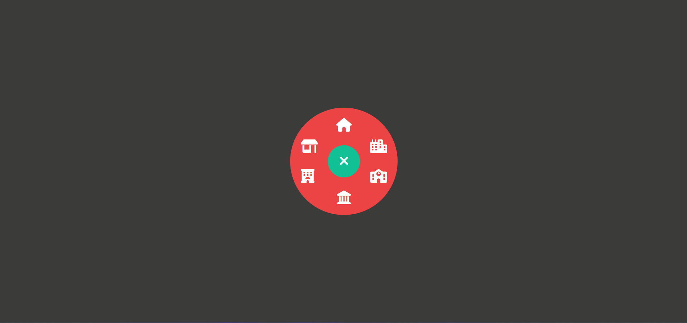

# Rounded_navigation

## Description
A hidden menu built with HTML, CCS, + JavaScript.  The menu is hidden initally, when the user clicks on the + symbol the menu is displayed. The menu is displayed using a rotation animation.  The + symbol rotates until it looks like an X.  When the user clicks on the X the menu closes.  An image of the opened menu is displayed below.

## Demo
A demo for the project can be found at:  https://tod619.github.io/Rounded_navigation/
